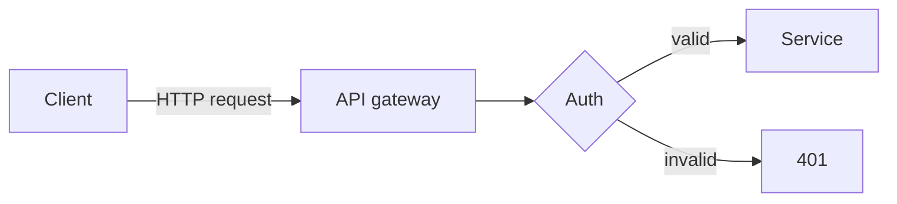

Blowfish ships a small set of opinionated shortcodes. Here are the ones I reach
for first.

## Badges

info
new
deprecated

## Buttons


View on GitHub



About this site


## Icons and the lead block

Blowfish's lead paragraph pulls icon-supported emphasis. Pick an icon from the
[FontAwesome 6 set](https://fontawesome.com/icons):

>  Source code on
> [github.com/vitorcoffee](https://github.com/vitorcoffee).

## Article callouts

The `article` shortcode renders a card linking to another post. The full
syntax is documented on the
[shortcodes reference page](https://blowfish.page/docs/shortcodes/#article).

## Mermaid diagrams

Blowfish renders Mermaid blocks server-side, so the diagram appears as inline
SVG (no JS runtime needed):

That's enough to get started. The full list is in the
[shortcodes reference](https://blowfish.page/docs/shortcodes/).
